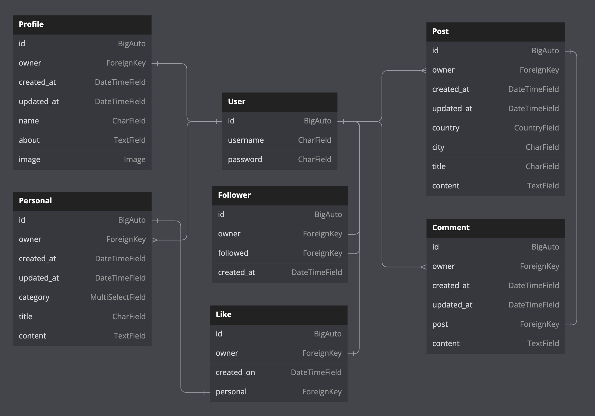
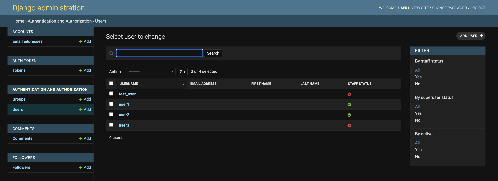

# Hissr DRF API
This is the API for the frontend application Hissr.
The live project can be found [here](https://hissr-drf-api.herokuapp.com).
## Table of Contents
1. [User Stories](https://github.com/wayne-AF/hissr-drf-api/edit/main/README.md#user-stories)
2. [Database](https://github.com/wayne-AF/hissr-drf-api/edit/main/README.md#database)
3. [Design](https://github.com/wayne-AF/hissr-drf-api/edit/main/README.md#design)
4. [Technologies Used](https://github.com/wayne-AF/hissr-drf-api/edit/main/README.md#technologies-used)
5. [Testing](https://github.com/wayne-AF/hissr-drf-api/edit/main/README.md#testing)
	- [Validation](https://github.com/wayne-AF/hissr-drf-api/edit/main/README.md#validation)
	- [Testing user stories](https://github.com/wayne-AF/hissr-drf-api/edit/main/README.md#testing-user-stories)
	- [Automated testing](https://github.com/wayne-AF/hissr-drf-api/edit/main/README.md#automated-testing)
6. [Acknowledgements](https://github.com/wayne-AF/hissr-drf-api/edit/main/README.md#acknowledgements)
## User stories
This API serves as the backend for the frontend application Hissr, a community and dating site for cats. The backend is for the use of the admin, so all user stories pertain to them.
1. I want the ability to create users.
2. I want the ability to edit users.
3. I want the ability to edit permissions for users.
4. I want the ability to delete users.
5. I want the ability to edit profiles. 
6. I want the ability to delete profiles.
7. I want the ability to create posts.
8. I want the ability to edit posts.
9. I want the ability to delete posts.
10. I want the ability to create personals.
11. I want the ability to edit personals.
12. I want the ability to delete personals.
13. I want the ability to create comments.
14. I want the ability to edit comments.
15. I want the ability to delete comments.
16. I want the ability to create a like.
17. I want the ability to delete a like.
18. I want the ability to create a follow.
19. I want the ability to delete a follow.
## Database
Database model structure of the API

#### User model
- Contains information about the user
- One-to-one relation with Profile model owner field
- ForeignKey relation with the Post model owner field
- ForeignKey relation with the Personal model owner field
- ForeignKey relation with the Comment model owner field
- ForeignKey relation with the Like model owner field
- ForeignKey relation with the Follower model owner and followed fields
#### Profile model
- Contains fields for the user to display information about themselves on their profile page
- MultiSelectField for looking_for allows a user to select from a number of options to specify what they are looking for on the site, i.e. dating, friends, chats, etc.
- One-to-one relation between the owner field and the User model ID field
#### Post model
MultiSelectField for category allows a user to select from a number of options to categorise the topic of the post
- ForeignKey relation between the owner field and the User model ID field
- ForeignKey relation with the Comment model post field
- ForeignKey relation with the Like model post field
#### Personal model
- Differs from the Post model in that users cannot like or comment on a personal, they can only reply directly to the user who made the personal
- Boolean for connection_made field is set to false by default so that when the user finds the person they were looking for, they can mark this field to true
- ForeignKey relation between the owner field and the User model ID field
#### Comment model
- ForeignKey relation between the owner field and the User model ID field
- ForeignKey relation between the post field and the Post model ID field
#### Like model
- ForeignKey relation between the owner field and the User model ID field
- ForeignKey relation between the post field and the Post model ID field
#### Follower model
- ForeignKey relation between the owner field and the User model ID field
- ForeignKey relation between the followed field and the User model ID field
## Design
### Default profile picture
The default profile image of a cat's silhouette was chosen as the default profile photo because the site is intended for use by cats. 

## Technologies Used
### Languages used:
- Python
- Django
### Libraries, Tools & Resources used:
- [APITestCase](https://www.django-rest-framework.org/api-guide/testing/) - Used for automated testing
- [Cloudinary](https://cloudinary.com) - Used to store static files
- [Coverage.py](https://coverage.readthedocs.io/en/7.2.2/) - Used to measure the effectiveness of the unit testing.
- [DBDiagram.io](https://dbdiagram.io/home) - Used for creation of entity relationship diagram
- [Django AllAuth](https://django-allauth.readthedocs.io/en/latest/index.html) - Used for user authentication
- [Django Countries](https://pypi.org/project/django-countries/) - Used to provide country choices for profile, post, and personal models.
- [Django MultiSelectField](https://pypi.org/project/django-multiselectfield/) - Used to allow user to select multiple fields in profile and post models.
- [Django REST Framework](https://www.django-rest-framework.org/) - Used to build the API
- [ElephantSQL](https://www.elephantsql.com/) - Used for PostgresSQL database
- [Git](https://git-scm.com/) - Used for version control by committing to Git and pushing to GitHub
- [GitHub](https://github.com/) - Used to store the code pushed from Git
- [MiniWebTool.com](https://miniwebtool.com/django-secret-key-generator/) - Used for generating secret key
- [Pillow](https://pillow.readthedocs.io/en/stable/) - Used for image processing
- [PyCodeStyle](https://pycodestyle.pycqa.org/en/latest/index.html) - Used to confirm PEP8 validation
- [Vectorstock](https://www.vectorstock.com/) - Used to default profile photo.
## Testing
### Validation
The PyCodeStyle tool was used to check for compliance with PEP8 style conventions. 
### Testing user stories

Test 1 - Ability to create a user

Test 2 - Ability to edit a user

Test 3 - Ability to edit user permissions

Test 4 - Ability to delete a user

Test 5 - Ability to edit a profile

Test 6 - Ability to delete a profile

Test 7 - Ability to create posts

Test 8 - Ability to edit posts

Test 9 - Ability to delete posts

Test 10 - Ability to create personals

Test 11 - Ability to edit personals

Test 12 - Ability to delete personals

Test 13 - Ability to create comments on posts

Test 14 - Ability to edit comments

Test 15 - Ability to delete comments

Test 16 - Ability to create a like

Test 17 - Ability to delete a like

Test 18 - Ability to create a follow

Test 19 - Ability to delete a follow

### Automated testing
Automated testing was carried out using Django Rest Framework's APITestCase.

 
#### Comments unit tests
- Checks that a logged-out user cannot create a comment
- Checks that a logged-in user can create a comment
- Checks that a comment with a valid ID can be retrieved
- Checks that a comment with an invalid ID cannot be retrieved
- Checks that a comment must include required fields before posting
- Checks that a user can update their own comment
- Checks that a user cannot update someone else's comment
- Checks that a user can delete their own comment
- Checks that a user cannot delete someone else's comment
#### Followers unit tests
- Checks that a logged-out user cannot follow a user
- Checks that a logged-in user can follow a user
- Checks that a user can unfollow a user
- Checks that a user cannot perform an unfollow on behalf of another user
- Checks that a following instance with a valid ID can be retrieved
- Checks that a follow instance with an invalid ID cannot be retrieved
#### Likes unit tests
- Checks that a logged-out user cannot like a post
- Checks that a logged-in user can like a post
- Checks that a user can unlike a post they have previously liked
- Checks that a user cannot remove another user's like
- Checks that a like instance with a valid ID can be retrieved
- Checks that a like instance with invalid ID cannot be retrieved
#### Personals unit tests
- Checks that a user can see a list of personals
- Checks that a logged-out user cannot create a personal
- Checks that a logged-in user can create a personal
- Checks that a personal must include required fields before posting
- Checks that a user can update their own personal
- Checks that a user cannot update someone else's personal
- Checks that a user can delete their own personal
- Checks that a user cannot delete someone else's personal
- Checks that a personal with a valid ID can be retrieved
- Checks that a personal with invalid ID cannot be retrieved
#### Posts unit tests
- Checks that a user can see a list of posts
- Checks that a logged-out user cannot create a post
- Checks that a logged-in user can create a post
- Checks that a post must include required fields before posting
- Checks that a user can update their own post
- Checks that a user cannot update someone else's post
- Checks that a user can delete their own post
- Checks that a user cannot delete someone else's post
- Checks that a post with a valid ID can be retrieved
- Checks that a post with an invalid ID cannot be retrieved
#### Profiles unit tests
- Checks that a user can see a list of profiles
- Checks that a user can update their own profile
- Checks that a user cannot update someone else's profile
- Checks that a user can delete their own profiles
- Checks that a user cannot delete someone else's profile
- Checks that a profile with a valid ID can be retrieved
- Checks that a profile with an invalid ID cannot be retrieved
### Coverage
The Coverage tool was used to gauge the effectiveness of the automated testing. 

Coverage report screenshot

## Acknowledgements
Thanks to my mentor Mo Shami for his guidance and suggestions.