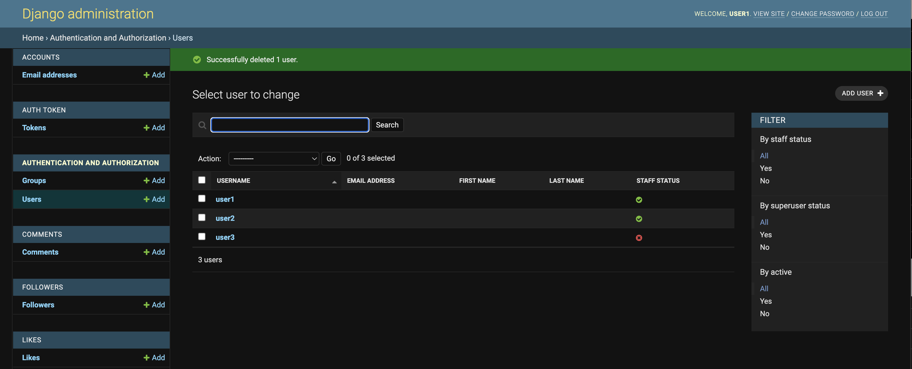
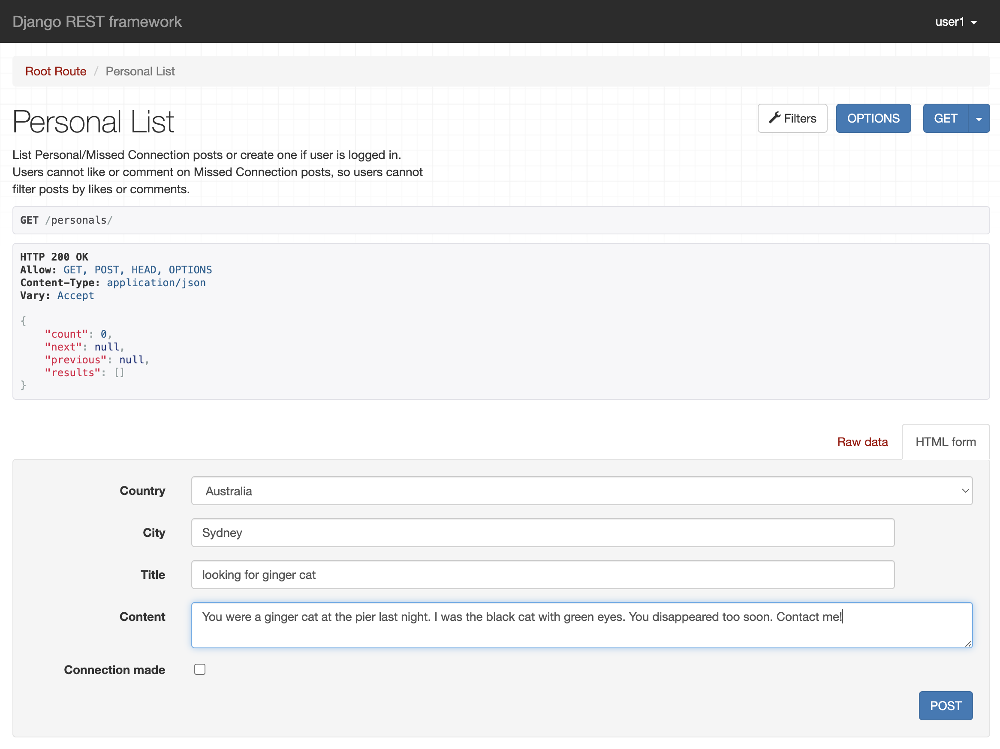
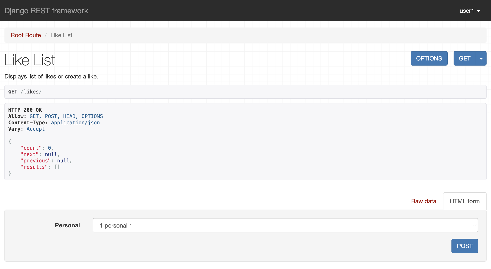
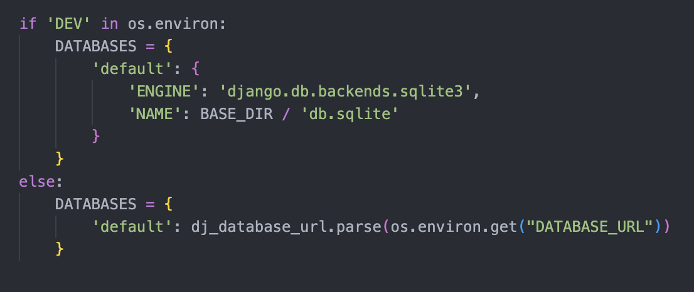

# Hissr DRF API
This is the API for the frontend application Hissr.
The live project can be found [here](https://hissr-drf-api.herokuapp.com).
## Table of Contents
1. [User Stories](#user-stories)
2. [Database](#database)
3. [Design](#design)
4. [Technologies Used](#technologies-used)
5. [Testing](#testing)
	- [Validation](#validation)
	- [Testing user stories](#testing-user-stories)
	- [Automated testing](#automated-testing)
6. [Deployment](#deployment)
7. [Acknowledgements](#acknowledgements)
## User stories
This API serves as the backend for the frontend application Hissr, a community and social site for cats. The backend is for the use of the admin, so all user stories pertain to them.
1. I want the ability to create users.
2. I want the ability to edit users.
3. I want the ability to edit permissions for users.
4. I want the ability to delete users.
5. I want the ability to edit profiles. 
6. I want the ability to delete profiles.
7. I want the ability to create posts.
8. I want the ability to edit posts.
9. I want the ability to delete posts.
10. I want the ability to create personals.
11. I want the ability to edit personals.
12. I want the ability to delete personals.
13. I want the ability to create comments.
14. I want the ability to edit comments.
15. I want the ability to delete comments.
16. I want the ability to create a like.
17. I want the ability to delete a like.
18. I want the ability to create a follow.
19. I want the ability to delete a follow.
## Database
Database model structure of the API

#### User model
- Contains information about the user
- One-to-one relation with Profile model owner field
- ForeignKey relation with the Post model owner field
- ForeignKey relation with the Personal model owner field
- ForeignKey relation with the Comment model owner field
- ForeignKey relation with the Like model owner field
- ForeignKey relation with the Follower model owner and followed fields
#### Profile model
- Contains about field the user to display information about themselves on their profile page
- One-to-one relation between the owner field and the User model ID field
#### Post model
- Country field allows users to choose their country from a dropdown list
- ForeignKey relation between the owner field and the User model ID field
- ForeignKey relation with the Comment model post field
#### Personal model
- Users can like a personal but not post a comment
- ForeignKey relation between the owner field and the User model ID field
- ForeignKey relation with the Like model personal field
#### Comment model
- ForeignKey relation between the owner field and the User model ID field
- ForeignKey relation between the post field and the Post model ID field
#### Like model
- ForeignKey relation between the owner field and the User model ID field
- ForeignKey relation between the personal field and the Personal model ID field
#### Follower model
- ForeignKey relation between the owner field and the User model ID field
- ForeignKey relation between the followed field and the User model ID field
## Design
### Default profile picture
The default profile image of a cat's silhouette was chosen as the default profile photo because the site is intended for use by cats.

## Technologies Used
### Languages used:
- Python
- Django
### Libraries, Tools & Resources used:
- [APITestCase](https://www.django-rest-framework.org/api-guide/testing/) - Used for automated testing
- [Cloudinary](https://cloudinary.com) - Used to store static files
- [Coverage.py](https://coverage.readthedocs.io/en/7.2.2/) - Used to measure the effectiveness of the unit testing.
- [DBDiagram.io](https://dbdiagram.io/home) - Used for creation of entity relationship diagram
- [Django AllAuth](https://django-allauth.readthedocs.io/en/latest/index.html) - Used for user authentication
- [Django Countries](https://pypi.org/project/django-countries/) - Used to provide country choices for profile, post, and personal models.
- [Django MultiSelectField](https://pypi.org/project/django-multiselectfield/) - Used to allow user to select multiple fields in profile and post models.
- [Django REST Framework](https://www.django-rest-framework.org/) - Used to build the API
- [ElephantSQL](https://www.elephantsql.com/) - Used for PostgresSQL database
- [Git](https://git-scm.com/) - Used for version control by committing to Git and pushing to GitHub
- [GitHub](https://github.com/) - Used to store the code pushed from Git
- [MiniWebTool.com](https://miniwebtool.com/django-secret-key-generator/) - Used for generating secret key
- [Pillow](https://pillow.readthedocs.io/en/stable/) - Used for image processing
- [PyCodeStyle](https://pycodestyle.pycqa.org/en/latest/index.html) - Used to confirm PEP8 validation
- [Vectorstock](https://www.vectorstock.com/) - Used to default profile photo.
## Testing
### Validation
The PyCodeStyle tool was used to check for compliance with PEP8 style conventions. 
### Testing user stories
**Test #** | **Function** | **Action** | **Expectation** | **Result**
----------- | -------------------- | -------------------- | -------------------- | ----------
#01 | Ability to create a user. | Added user with name 'test_user' in admin panel. | User will be created. | PASS
#02 | Abilty to edit a user. | Updated name of 'test_user' to 'test_user_updated' in admin panel. | Username will be updated. | PASS
#03 | Ability to edit user permissions. | In use profile in admin panel, changed permissions to give test_user_updated staff status. | User will have staff status.  |  PASS
#04 | Ability to delete a user. | Deleted test_user_updated in admin panel. | User will no longer exist. | PASS
#05 | Ability to edit a profile. | Edited profile for test_user_2. | Edits will be visible in test_user_2's profile. | PASS
#06 | Ability to delete a profile. | Deleted profile for test_user_2. | test_user_2's profile will no longer exist. | PASS
#07 | Ability to create a post. | Created a post by user1. | Post will be visible in list of posts. | PASS
#08 | Ability to edit a post. | Edited title and content of previously created post. | Edits will be visible in the post. | PASS
#09 | Ability to delete a post. | Deleted previously created post. | Post will no longer be visible in list of post. | PASS
#10 | Ability to create a personal. | Created a personal by user1. | Personal will appear in list of personals. | PASS
#11 | Ability to edit a personal. | Edited title and content of previously created personal. | Edits will be visible in the personal. | PASS
#12 | Ability to delete a personal. | Deleted previously created personal. | Personal will no longer be visible in list of personals. | PASS
#13 | Ability to create comments on posts. | Created a comment by user1 on an existing post. | Comment will be visible in list of comments. | PASS
#14 | Ability to edit comments. | Edited previously created comment. | Edits will be visible in the comment. | PASS
#15 | Ability to delete comments. | Deleted previously created comment. | Comment will no longer be visible in list of comments. | PASS
#16 | Ability to create a like. | Created a like for user1 on an existing personal. | Like will be visible in list of likes. | PASS
#17 | Ability to delete a like. | Deleted previously created like. | Like will no longer be visible in list of likes. | PASS
#18 | Ability to create a follow. | Created a follow for user1. | Follow will be visible in list of followers. | PASS
#19 | Ability to delete a follow. | Deleted previously created follow. | Follow will no longer be visible in list of followers. | PASS

Test 1 - Ability to create a user

Test 2 - Ability to edit a user

Test 3 - Ability to edit user permissions

Test 4 - Ability to delete a user

Test 5 - Ability to edit a profile

Test 6 - Ability to delete a profile

Test 7 - Ability to create posts

Test 8 - Ability to edit posts

Test 9 - Ability to delete posts

Test 10 - Ability to create personals

Test 11 - Ability to edit personals

Test 12 - Ability to delete personals

Test 13 - Ability to create comments on posts

Test 14 - Ability to edit comments

Test 15 - Ability to delete comments

Test 16 - Ability to create a like

Test 17 - Ability to delete a like

Test 18 - Ability to create a follow

Test 19 - Ability to delete a follow

### Automated testing
Automated testing was carried out using Django Rest Framework's APITestCase.

 
#### Comments unit tests
- Checks that a logged-out user cannot create a comment
- Checks that a logged-in user can create a comment
- Checks that a comment with a valid ID can be retrieved
- Checks that a comment with an invalid ID cannot be retrieved
- Checks that a comment must include required fields before posting
- Checks that a user can update their own comment
- Checks that a user cannot update someone else's comment
- Checks that a user can delete their own comment
- Checks that a user cannot delete someone else's comment
#### Followers unit tests
- Checks that a logged-out user cannot follow a user
- Checks that a logged-in user can follow a user
- Checks that a user can unfollow a user
- Checks that a user cannot perform an unfollow on behalf of another user
- Checks that a following instance with a valid ID can be retrieved
- Checks that a follow instance with an invalid ID cannot be retrieved
#### Likes unit tests
- Checks that a logged-out user cannot like a personal
- Checks that a logged-in user can like a personal
- Checks that a user can unlike a personal they have previously liked
- Checks that a user cannot remove another user's like
- Checks that a like instance with a valid ID can be retrieved
- Checks that a like instance with invalid ID cannot be retrieved
#### Personals unit tests
- Checks that a user can see a list of personals
- Checks that a logged-out user cannot create a personal
- Checks that a logged-in user can create a personal
- Checks that a personal must include required fields before posting
- Checks that a user can update their own personal
- Checks that a user cannot update someone else's personal
- Checks that a user can delete their own personal
- Checks that a user cannot delete someone else's personal
- Checks that a personal with a valid ID can be retrieved
- Checks that a personal with invalid ID cannot be retrieved
#### Posts unit tests
- Checks that a user can see a list of posts
- Checks that a logged-out user cannot create a post
- Checks that a logged-in user can create a post
- Checks that a post must include required fields before posting
- Checks that a user can update their own post
- Checks that a user cannot update someone else's post
- Checks that a user can delete their own post
- Checks that a user cannot delete someone else's post
- Checks that a post with a valid ID can be retrieved
- Checks that a post with an invalid ID cannot be retrieved
#### Profiles unit tests
- Checks that a user can see a list of profiles
- Checks that a user can update their own profile
- Checks that a user cannot update someone else's profile
- Checks that a user can delete their own profiles
- Checks that a user cannot delete someone else's profile
- Checks that a profile with a valid ID can be retrieved
- Checks that a profile with an invalid ID cannot be retrieved
### Coverage
The Coverage tool was used to gauge the effectiveness of the automated testing. 

Coverage report screenshot

## Deployment
Heroku was used as the deployment platform for this project. Deployment steps are as follows.
1. Log into [ElephantSQL](https://www.elephantsql.com/) to access the dashboard.
2. Create a new instance of a database.
3. Set up your plan:
	- Give your plan a name (typically the name of the project)
	- Select the Tiny Turtle free plan
	- Leave the Tags field blank
4. Select "Select Region" and select a data center near you.
5. Select "Review" and check the details are correct before selecting "Create instance".
6. Return to the ElephantSQL dashboard and select the database name you have just created.
7. In the URL section, copy the database URL. 
8. Log into [Heroku](https://www.heroku.com) and go to the Dashboard.
9. Select "New" and then "Create new app".
10. Choose a unique name for your app and select the region closest to you. Select "Create app" to confirm.
11. Open the Settings tab and add a KEY:VALUE Config Var pair with DATABASE_URL and the copied database URL from ElephantSQL.
12. In the terminal of your Gitpod project, install dj_database_url and psycopg2 to connect to your external database:
	- `pip3 install dj_database_url==0.5.0 psycopg2`
13. In settings.py, import dj_database_url underneath the `import os`: 
	- `import dj_database_url`
14. Update the DATABASES section to the following:
	- 

Databases section

		
		

15. In env.py, add an environment variable for the database URL. The quotes are required:
	- `os.environ["DATABASE_URL"] = "ElephantSQL database URL here"`
16. Comment out `os.environ['DEV']` environment variable so that Gitpod can connect to the external database. 
17. Migrate your database models to your new database with `python3 manage.py migrate`.
18. Create a superuser for your database with `python3 manage.py createsuperuser` and follow the steps.
19. On your database page on ElephantSQL, select "BROWSER" from the vertical navigation bar on the left.
20. Select "Table queries" and from the dropdown menu, select "auth_user", and then the "Execute" button.
21. You should see the details of your newly created superuser, confirming that your API has successfully connected to the external database.
22. Back in your Gitpod terminal, install gunicorn with `pip3 install gunicorn django-cors-headers`.
23. Update your requirements.txt file with `pip freeze --local > requirements.txt`.
24. Create a Procfile in your base directory, and add:
	- `release: python manage.py makemigrations && python manage.py migrate`
	- `web: gunicorn drf_api.wsgi`
25. In settings.py, update the ALLOWED_HOSTS variable:
	- `ALLOWED_HOSTS = ['localhost', 'heroku_app_name.herokuapp.com']`
26. Add `corsheaders` to INSTALLED_APPS before `dj_rest_auth.registration`
27. Add `corsheaders.middleware.CorsMiddleware` to the top of `MIDDLEWARE = [...]`
28. Under the MIDDLEWARE list, set the ALLOWED_ORIGINS for the server network requests with this:
	- 

ALLOWED_ORIGINS set

		
		

29. Under this, set `CORS_ALLOW_CREDENTIALS = True`.
30. To be able to deploy the front-end app and the API to different platforms, set the `JWT_AUTH_SAMESITE` to `None`:
	- `JWT_AUTH_COOKIE = 'my-app-auth'`
	- `JWT_AUTH_REFRESH_COOKIE = 'my-refresh-token'`
	- `JWT_AUTH_SAMESITE = 'None'`
31. Correctly set `SECRET_KEY = os.environ.get('SECRET_KEY')` in settings.py, and set the environment variable in env.py `os.environ['SECRET_KEY'] = 'secret_key_value_here'`
32. Set the DEBUG value in settings.py to be true only if the DEV environment variable exists `DEBUG = 'DEV' in os.environ` and comment `os.environ['DEV'] = '1'` back in env.py.
33. Ensure the project requirements.txt is up to date with `pip freeze --local > requirements.txt` and add, commit, and push all the changes to Github.
34. Back in Heroku, navigate to the Settings tab on the dashboard for your newly created app. 
35. Add two new KEY:VALUE pairs in the Config Vars section:
	- SECRET_KEY: (value from your env.py file)
	- CLOUDINARY_URL: (value from your env.py file)
	- DISABLE_COLLECTSTATIC: 1
36. Navigate to the Deploy tab.
37. In the Deployment method section, select the Github method, and then search for and connect your Github repository.
38. If you wish, you can select the "Enable Automatic Deploys" if you wish any further repository changes to be automatically applied to the project.
39. Select "Deploy Branch" from the Manual deploy section and the build process will start. Once the app has deployed successfully, you will receive a confirmation message. 
40. Select the "Open app" button at the top of the page and you will be able to view your deployed app. 
41. To make sure that the API can be used effectively with the React front-end project, you must add two environment variables to settings.py.
42. In settings.py, in the ALLOWED_HOSTS list, copy the `heroku_app_name.herokuapp.com` string, and replace it with `os.environ.get('ALLOWED_HOST')`, so it looks like this:
	- `ALLOWED_HOSTS = [os.environ.get('ALLOWED_HOST'), 'localhost',]`
43. Navigate to the Config Vars section in the Settings tab on your app's Heroku dashboard and add a new KEY:VALUE pair:
	- ALLOWED_HOST: (value you copied from the ALLOWED_HOSTS in settings.py)
44. In order to better accommodate the way Gitpod works by changing the workspace URL periodically, we must make one final change to settings.py. 
45. At the top of settings.py, insert `import re`.
46. Update the `if 'CLIENT_ORIGIN' in os.environ` section to match the below code:
	- 

CLIENT_ORIGIN section

		
		

47. This piece of code is used to allow the API to communicate with the front-end development environment and the value for CLIENT_ORIGIN_DEV is set in the Deployment section of that repository.
48. To use [Cloudinary](https://cloudinary.com) for static file storage, navigate to your Cloudinary account.
49. On the Dashboard page, copy the "API Environment variable" from the Product Environment Credentials section.
50. In the API's env.py file, create an environment variable and set it the value of the copied API Environment variable, making sure to remove "CLOUDINARY_URL=" from the start of the copied text:
	- `os.environ['CLOUDINARY_URL'] = 'cloudinary://***********************************'`
51. In settings.py, insert the below code:
	- 

CLOUDINARY_STORAGE

		
		

52. Back in Heroku, navigate to the Settings tab on the dashboard for your API.
53. Add a new KEY:VALUE pair in the config Var section:
	- CLOUDINARY_URL: (value from your env.py file that you copied from Cloudinary)
54. This will enable the API and, when it is connected, the front-end React app to both use Cloudinary for static file storage.

## Acknowledgements
Thanks to my mentor Mo Shami for his guidance and suggestions.